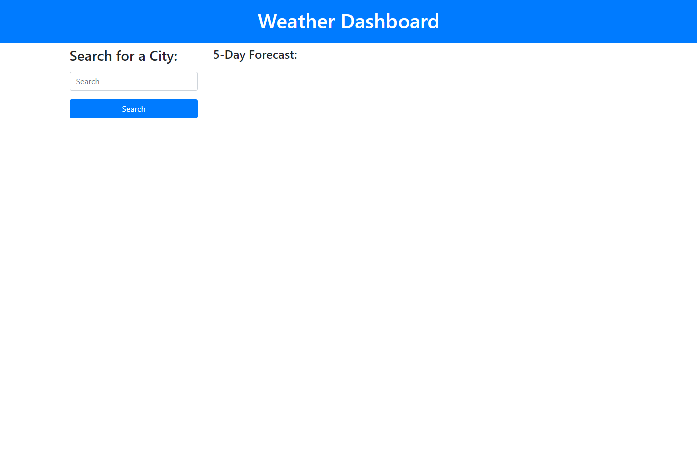
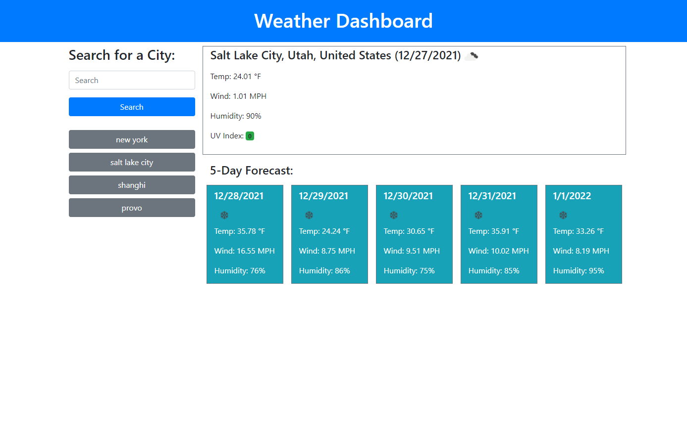

# Weather Dashboard

## Description

This challenge showed me a few things, mostly based around using objects with API's and functions. I learned how to better use objects and how to get info out of them. 

This app works by using the input field to search for a city, if its invalid city name, then it warns the user and asks them to try again. If its a valid city then it runs the OpenWeather One Call API to get weather data for the current day and 5 days in the future. it also stores the city name in the localStorage and creates a button for that city. You can always just click any of the city buttons to recall the weather for that city again.

## Installation

Follow the following link to load code into a browser.

[Weather Dashboard](https://johndavis92790.github.io/weather-dashboard/)

## Usage

Here are screenshots of the finished app:

